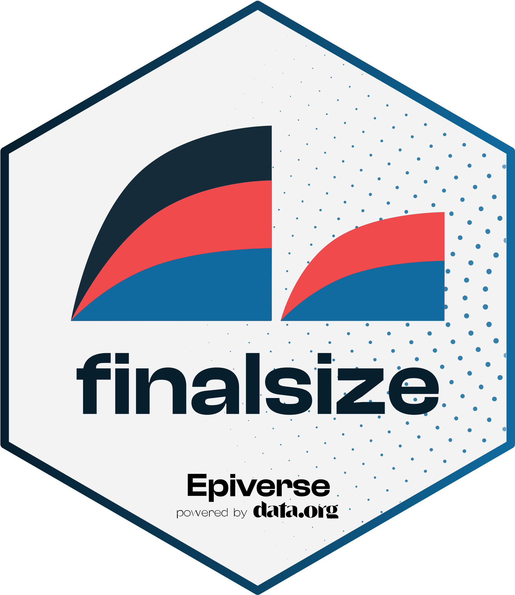

```{r, include = FALSE}
knitr::opts_chunk$set(
  collapse = TRUE,
  comment = "#>",
  fig.path = "man/figures/README-",
  out.width = "100%"
)
```

# {{ packagename }}: Calculate the final size of an epidemic 

<!-- badges: start -->
<a href="https://app.digitalpublicgoods.net/a/10557">
[](https://opensource.org/license/mit)
[](https://www.repostatus.org/#active)
[](https://github.com/{{ gh_repo }}/actions/workflows/R-CMD-check.yaml)
[](https://app.codecov.io/gh/{{ gh_repo }}?branch=main)
[](https://CRAN.R-project.org/package=finalsize)
<!-- badges: end -->

_{{ packagename }}_ is an R package to calculate the final size of a SIR epidemic in populations with heterogeneity in social contacts and infection susceptibility.

_{{ packagename }}_ provides estimates for the total proportion of a population infected over the course of an epidemic, and can account for a demographic distribution (such as age groups) and demography-specific contact patterns, as well as for heterogeneous susceptibility to infection between groups (such as due to age-group specific immune responses) and within groups (such as due to immunisation programs). An advantage of this approach is that it requires fewer parameters to be defined compared to a model that simulates the full transmission dynamics over time, such as models in the [_epidemics_ package](https://epiverse-trace.github.io/epidemics/articles/epidemics.html).

_{{ packagename }}_ implements methods outlined in @andreasen2011, @miller2012, @kucharski2014, and @bidari2016.

_{{ packagename }}_ can help provide rough estimates of the effectiveness of pharmaceutical interventions in the form of immunisation programmes, or the effect of naturally acquired immunity through previous infection (see the vignette).

_{{ packagename }}_ relies on [Eigen](https://gitlab.com/libeigen/eigen) via [RcppEigen](https://github.com/RcppCore/RcppEigen) for fast matrix algebra, and is developed at the [Centre for the Mathematical Modelling of Infectious Diseases](https://www.lshtm.ac.uk/research/centres/centre-mathematical-modelling-infectious-diseases) at the London School of Hygiene and Tropical Medicine as part of the [Epiverse-TRACE](https://data.org/initiatives/epiverse/).

## Installation

The package can be installed from CRAN using

```r
install.packages("finalsize")
```

### Development version

The current development version of _{{ packagename }}_ can be installed from [Github](https://github.com/{{ gh_repo }}) using the `remotes` package.
The development version documentation can be found [here](https://epiverse-trace.github.io/finalsize/dev/).

```r
if(!require("pak")) install.packages("pak")
pak::pak("{{ gh_repo }}")
```

## Quick start

The main function in _{{ packagename }}_ is `final_size()`, which calculates the final size of an epidemic given the $R_0$.

```{r}
# load finalsize
library(finalsize)

final_size(1.5)
```

Optionally, `final_size()` can estimate the epidemic size for populations with differences among demographic groups in their social contact patterns, in their susceptibility to infection.

We can use social contact data (here, from the _socialmixr_ package) to estimate the final size of an epidemic when the disease has an R<sub>0</sub> of 1.5, and given three age groups of interest --- 0-19, 20-39 and 40+.
The under-20 age group is assumed to be fully susceptible to the disease, whereas individuals aged over 20 are only half as susceptible as those under 20.

```{r}
# Load example POLYMOD social contacts data included with the package
data(polymod_uk)

# Define contact matrix (entry {ij} is contacts in group i reported by group j)
contact_matrix <- polymod_uk$contact_matrix

# Define population in each age group
demography_vector <- polymod_uk$demography_vector

# Define susceptibility of each group
susceptibility <- matrix(
  data = c(1.0, 0.5, 0.5),
  nrow = length(demography_vector),
  ncol = 1
)

# Assume uniform susceptibility within age groups
p_susceptibility <- matrix(
  data = 1.0,
  nrow = length(demography_vector),
  ncol = 1
)

# R0 of the disease
r0 <- 1.5 # assumed for pandemic influenza

# Calculate the proportion of individuals infected in each age group
final_size(
  r0 = r0,
  contact_matrix = contact_matrix,
  demography_vector = demography_vector,
  susceptibility = susceptibility,
  p_susceptibility = p_susceptibility
)
```

Helper functions included in _{{ packagename }}_ are provided to calculate the effective $R_0$, called $R_{eff}$, from demographic and susceptibility distribution data, while other helpers can convert between $R_0$ and the transmission rate $\lambda$.

```{r}
# calculate the effective R0 using `r_eff()`
r_eff(
  r0 = r0,
  contact_matrix = contact_matrix,
  demography_vector = demography_vector,
  susceptibility = susceptibility,
  p_susceptibility = p_susceptibility
)
```

## Package vignettes

More details on how to use _{{ packagename }}_ can be found in the [online documentation as package vignettes](https://epiverse-trace.github.io/finalsize/), under "Articles".

## Help

To report a bug please open an [issue](https://github.com/{{ gh_repo }}/issues/new/choose).

## Contribute

Contributions to _{{ packagename }}_ are welcomed. Please follow the [package contributing guide](https://github.com/{{ gh_repo }}/blob/main/.github/CONTRIBUTING.md).

## Code of conduct

Please note that the _{{ packagename }}_ project is released with a [Contributor Code of Conduct](https://github.com/epiverse-trace/.github/blob/main/CODE_OF_CONDUCT.md). By contributing to this project, you agree to abide by its terms.


## Citing this package

```{r message=FALSE, warning=FALSE}
citation("finalsize")
```

## References
